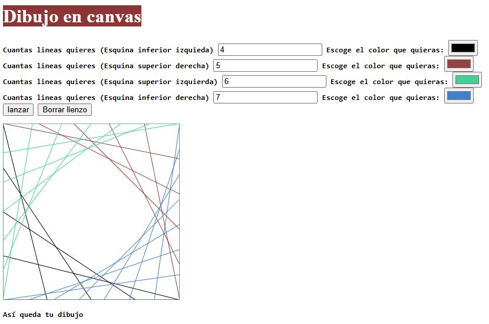

# 🎨 Dibujodelineas2

Proyecto básico en **HTML** y **JavaScript** que permite dibujar líneas dentro de un elemento `<canvas>`, calculando sus posiciones de forma dinámica a partir de un número ingresado por el usuario.



---

## 🚀 Descripción

**Dibujodelineas2** es un proyecto creado como práctica para comprender el uso del elemento `<canvas>` de HTML y su manipulación mediante JavaScript puro.

El usuario ingresa un número, y el script calcula las posiciones necesarias para trazar líneas en el lienzo, generando un patrón geométrico.  
Es una excelente introducción al dibujo programático en la web.

---

## 🧰 Tecnologías utilizadas

- **HTML5** → estructura del documento y definición del lienzo (`<canvas>`).
- **JavaScript (Vanilla JS)** → cálculos y dibujo dinámico en el canvas mediante la API `CanvasRenderingContext2D`.

---

## 🧮 Funcionamiento

1. El usuario introduce un número en un campo de entrada.
2. El programa toma ese número para calcular las coordenadas de cada línea.
3. Se dibujan automáticamente sobre el `<canvas>` usando los métodos de dibujo nativos de JavaScript.

Ejemplo básico de dibujo:

```javascript
const lienzo = document.getElementById("dibujito").getContext("2d");
lienzo.beginPath();
lienzo.moveTo(xInicial, yInicial);
lienzo.lineTo(xFinal, yFinal);
lienzo.stroke();